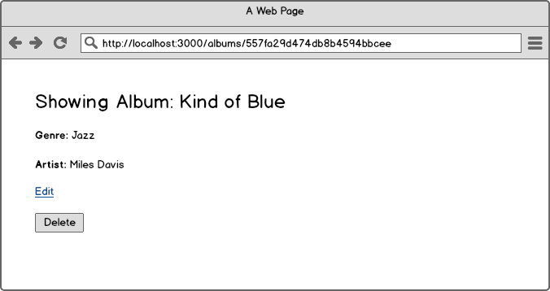

# Express CRUD with Albums

## Approach

As we continue transitioning towards being practicioners of Extreme Programming, we will learn to use wireframes (and other design elements) as a means for better understanding how the User Interface (UI) of the application should appear. In general you will have higher resolution artifacts than wireframes; namely design comprehensives (generally referred to as _comps_) which lay out the appearance of the application in great deal. For this exercise complete adherence to the wireframes is not required, they are merely provided to give an outline of all of the behavior required - the visual appearance is up to you, have fun with it if you want to.

Begin by looking through the wireframes carefully and figuring out what the different features are. One thing to always think about when evaluating a design is any element of the page with which interaction may have a side effect. One such example is a link (`<a>` tag). Each time you see a link ask yourself "Where does this link go? What does clicking this link do?" Similarly, ask the same about any forms you see - should the data contained in the HTTP POST request end up persisted in a database or does the form have an action that should not modify the state of the database?

Although you are not writing tests for this exercise, try to keep in mind what the highest level test would look like and talk through it with your partner. Looking at the first wireframe:

This means making a comment like "when a user clicks on 'Let me see right now' they are taken to the albums index view" and then working together with your pair using Error Driven Development to do the smallest thing that satisfies the test case you have just established. It may even be useful to write down each of these requirements as you code; tomorrow we will repeat this exercise using TDD instead.

You are free to use whatever libraries you would like so long as Express is the base framework used.

## Wireframes

Pay attention to the URLs.

## Stretch goals

1. Use a CSS library like [Twitter Bootstrap](http://getbootstrap.com/) to style the application. This includes things like having a properly striped table for the index view, centering content for the root path of the application, etc.
1. If you chose to use [`monk`](https://github.com/Automattic/monk) re-write the application using [`mongoose`](http://mongoosejs.com/docs/guide.html) (or vice versa). Make sure to commit your work and branch, or create a new repository, so that you can compare your work between the two libraries.

    When you have completed this, answer the following questions with your pair:

    1. What are the differences between `monk` and `mongoose`?
    1. Why would you choose to use one of these packages over the other?
    1. What are some of the challenges inherent with using a "schemaless" database?
    1. Why is "schemaless" a misnomer for NoSQL datastores?

1. If you used a package like [`method-override`](https://github.com/expressjs/method-override), replace all usage of it with [`XMLHttpRequest`](https://developer.mozilla.org/en-US/docs/Web/API/XMLHttpRequest) (XHR).

## Reflection

As always, stop a few minutes before the end of the day and, working with your pair, answer the following questions:

1. Were you able to successfully use Error Driven Development?
1. What is the relationship between Error Driven Development and Test Driven Development?
1. How many test cases did you identify as you worked through this problem?
1. At any point did you and your pair differ on the interpretation of the wireframes? If so, what did you do to resolve them? If you were on a real team how would you handle this?
1. Did you use any pairing techniques that we have seen in the past?
1. Give each other two pieces of praise based on your work together for the day. Examples of this are things like "you did an excellent job catching syntax errors while I was driving, it made me feel like you were highly engaged in solving the problem with me." or "you did a great job communicating what you were thinking and checking in with me to see if we agreed before we moved forward."
